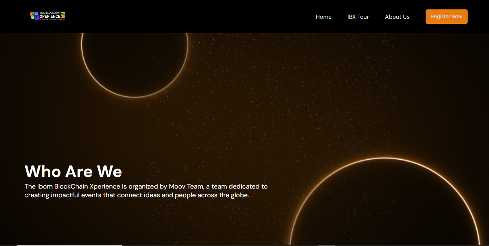

# IBom Blockchain Xperience - About Us Page

A responsive **About Us** page for the *Ibom Blockchain Xperience (IBX)* website.  
This page introduces the organization, showcases the team, highlights what they do, and provides global navigation + footer sections.

---

## Project Overview

This project is a frontend webpage built to present the **Moov Team**, organizers of the Ibom Blockchain Xperience. It includes:

- A responsive navigation bar  
- A hero/intro section  
- A “Meet the Team” gallery  
- A “What We Do” summary  
- A global footer with social icons and country indicators  

Designed to communicate professionalism while maintaining a clean, modern look.

---

## Features

### -- Responsive Navigation Bar
- Logo area  
- Hamburger menu icon for mobile  
- Navigation links  
- “Register Now” CTA button  

### -- Hero / Showcase Section
- Bold headline  
- Overview of the Ibom Blockchain Xperience  
- Clean, visually appealing layout  

### -- Meet the Team
- Team introduction text  
- Team member cards with image + name + role overlay  
- “Add to Calendar” CTA button  

### -- What We Do Section
- Overview of the organization’s experience and past events  
- Placeholder section for images or content blocks  

### -- Footer Section
- Country flag icons  
- Navigation links  
- Social media icons (FontAwesome)  
- Copyright  

---

## Tech Stack

- **HTML5**  
- **CSS3**  
- **JavaScript**  
- **FontAwesome 6.6.0** for icons  
- Custom images (PNG format)

---

## How to Run the Project

1. Clone or download the repository  
2. Open `index.html` in any modern browser  
3. Ensure internet connection for FontAwesome icons  
4. Confirm images are inside the `/img` folder 

---

## Preview

